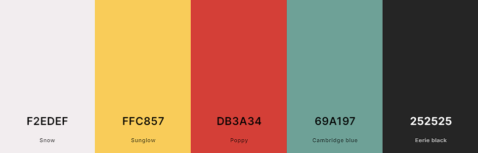

# Rock, Paper, Scissors, Lizard, Spock
(by Robyn Soar)

RPSLS (Rock, Paper, Scissors, Lizard, Spock) is a Website aimed at ages 4+, which contains a simple game of Rock, Paper, Scissors, Lizard, Spock. Made by Sam Kass & Karen Bryla, it is a game of chance which expanded on the traditional game of Rock, Paper, Scissors.
This Website allows users to play against the computer, with scores taken to document the winner of 3 games out of 5.

## Key Project Goals

## Target Audience

## Table of Contents

- [Features](#features)
    - [Site Wide](#sitewide)
    - [Landing Page](#landing-page)
    - [Existing Features](#existing-features)
    - [Features Left to Implement](#features-left-to-implement)
- [Design](#design)
    - [Wireframes](#wireframes)
    - [Colour Palette](#colour-palette)
    - [Google Fonts](#google-fonts)
    - [Technologies Used](#technologies-used)
- [Testing](#testing)
    - [Responsiveness](#responsiveness)
    - [Accessibility](#accessibility)
    - [Lighthouse Testing](#lighthouse-testing)
    - [Fuctional Testing](#functional-testing)
    - [Validator Testing](#validator-testing)
- [Deployment](#deployment)
    - [Version Control](#version-control)
    - [Deployment to GitHub Pages](#deployment-to-github-pages)
    - [Clone the Repository Code Locally](#clone-the-repository-code-locally)
- [Credits](#credits)
    - [Inspired Code](#inspired-code)
    - [Walkthrough Code](#walkthrough-code)
    - [Used Code](#used-code)
    - [Media](#media)
    - [Acknowledgements](#acknowledgements)
- [Author](#author)

## Features

### Site Wide

### Landing Page

### Existing Features

### Features Left to Implement

[Return to Table of Contents](#table-of-contents)

## Design

### Wireframes

### Colour Palette

The following colour palette was used throughout the Website to provide good contrast between elements and a 'retro' colour scheme to match the time period in which Star Trek (from which "Spock" is a character from) was first released.

- #F2EDEF - Background colour site-wide
- #FFC857 - Accent colour
- #DB3A34 - Accent colour
- #69A197 - Accent colour
- #252525 - Text colour site-wide



### Google Fonts

[Google Fonts](https://fonts.google.com/) was used to import fonts for the Website, these include:

- "Teko", sans-serif: Used for the Website logo and 'Rules' modal
- "Ubuntu Condensed", sans-serif: Used for all other text content site wide

### Technologies Used

- HTML
    - The main structure of the Website was developed using HTMl as the main language.

- CSS
    - The Website was styled using custom CSS in an external file.

- JavaScript
    - 

- GitHub
    - Source code is hosted on GitHub and deployed using Git Pages.

- Git
    - Used for development of the Website as well as commit and pushing code throughout.

- [Favicon.io](https://favicon.io/favicon-converter/)
    - Favicon files were created with this favicon converter.

- [TinyPNG](https://tinypng.com/)
    - Used TinyPNG to compress image assets to aid in the website running quicker.

- [Pixelied](https://pixelied.com/convert/jpg-converter/jpg-to-webp)
    - Used Pixelied to convert file types of image assets from jpg/png to webp to aid in the website running quicker.

- [Google Fonts](https://fonts.google.com/)
    - Used to import fonts used throughout the Website.

- [Coolors](https://coolors.co/)
    - Colour palette swatches.

- [Online PNG Tools](https://onlinepngtools.com/change-png-color)
    - Used to change the colours of the icons to match the site's colour palette.

[Return to Table of Contents](#table-of-contents)

## Testing

### Responsiveness

### Accessibility

### Lighthouse Testing

### Functional Testing

### Validator Testing

- HTML
    - [W3C Validator](https://validator.w3.org/)

- CSS
    - [W3C CSS Validation](https://jigsaw.w3.org/css-validator/)

- JavaScript
    - [JSHint Analysis Tool](https://jshint.com/)

### Unfixed Bugs

[Return to Table of Contents](#table-of-contents)

## Deployment

### Version Control

The site was created using the Git editor and pushed to GitHUb to the remote repository 'rpsls-game'

The following git commands were used throughout development to push code to the remote repository:

```git add <file>``` - This command was used to add the file(s) to the staging area before they are commited.

```git commit -m "commit message"``` - This command was used to commit changes to the local repository queue ready to be pushed.

```git push``` - This command was used to push all committed code to the remote repository 'rpsls-game' on GitHub.

### Deployment to GitHub Pages

The site was deployed to GitHub Pages. The steps to deploy are as follows:
1. In the GitHub repository, navigate to the 'Settings' tab
2. From the menu called 'Code and automation' on the left, select 'Pages'
3. From the Default branch drop down menu, select 'Main'
4. Click 'Save'
5. A live link will be displayed in a green banner when published succesfully.

The live link to 'rpsls-game' can be found here - [Rock, Paper, Scissors, Lizard, Spock Live]()

### Clone the Repository Code Locally

Navigate to the GitHub Repository you want to clone to use locally:
1. Click on the code drop down button
2. Click on HTTPS
3. Copy the repository link to the clipboard
4. Open your IDE of choice (Git must be installed for the next steps)
5. Type git close copied-git-url into the IDE terminal

The project will now of been cloned on your local machine for use.

[Return to Table of Contents](#table-of-contents)

## Credits

### Inspired Code

- [Woohoo Salon - Robyn Soar](https://github.com/RobynSoar/woohoo-salon/blob/main/README.md)
    - Rock, Paper, Scissors, Lizard, Spock's README.md layout and contents was inspired by my own README from a previous project, which was originially inspired by the following README:
        - [Taco Travels - Gareth McGirr](https://github.com/Gareth-McGirr/tacos-travels/blob/main/README.md)
            - Woohoo Salon's README.md layout and contents was inspired by this README.
        - [Writing a High Quality README! - Blog](https://dev.to/coderarchive/writing-a-high-quality-readme-1k3j)
            - Woohoo Salon's README.md layout and contents was also inspired by this README to confirm I had the correct content for a good quality README.

- [Code Insitute](https://learn.codeinstitute.net/ci_program/diplomainfullstacksoftwarecommoncurriculum)
    - Code Institute's programme helped me throughout the site with how to write sections of basic code.

### Walkthrough Code

- [W3Schools](https://www.w3schools.com/howto/howto_css_modals.asp)
    - RPSLS's 'rules' modal was created with the walkthrough from this website.

- [Hacker.io](https://hackr.io/blog/how-to-build-rock-paper-scissors-in-javascript)
    - Some parts of this walkthrough aided with a push in the right direction with JavaScript for the RPSLS game site.

### Used Code

### Media

- [Free ICONS Library](https://icon-library.com/)
    - Icons for the RPSLS game choices were found via this site.

- [Icons8](https://icons8.com/)
    - Favicon image.

### Acknowledgements

[Return to Table of Contents](#table-of-contents)

## Author

Robyn Soar
robyn999@hotmail.co.uk