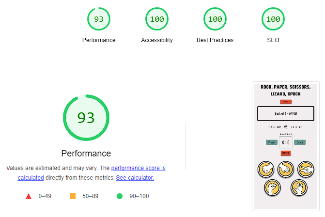
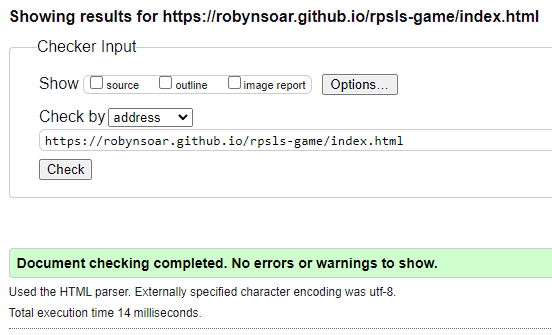

# Rock, Paper, Scissors, Lizard, Spock
(by Robyn Soar)

RPSLS (Rock, Paper, Scissors, Lizard, Spock) is a Website aimed at ages 4+, which contains a simple game of Rock, Paper, Scissors, Lizard, Spock. Made by Sam Kass & Karen Bryla, it is a game of chance which expanded on the traditional game of Rock, Paper, Scissors.
This Website allows users to play against the computer, with scores taken to document the win, lose of draw out of 5 rounds. View the live site [here](https://robynsoar.github.io/rpsls-game/).

## Key Project Goals

- A Website that leaves a positive first impression that lasts and grows throughout the whole experience of the site.
- To make the site intuitive for users of all ages above 4+.
- Allow the user to play an online game that has elements of chance.
- Give users the ability to play against the computer.
- Give the users a score tracking system.
- Gives the users a limited number of tries before the game is over.

## Target Audience

- The primary target audience for the Website is 4+ years old, aimed at fans of the original game known by "Rock Paper Scissors" or the adapted game played on this site, "Rock Paper Scissors Lizard Spock", and futhermore, fans of the shows "The Big Bang Theory" where this game was mentioned and "Star Trek" of which the character "Spock" belongs to.


## Table of Contents

- [Features](#features)
    - [Site Wide](#sitewide)
    - [Landing Page](#landing-page)
    - [Existing Features](#existing-features)
    - [Features Left to Implement](#features-left-to-implement)
- [Design](#design)
    - [Wireframes](#wireframes)
    - [Colour Palette](#colour-palette)
    - [Google Fonts](#google-fonts)
    - [Technologies Used](#technologies-used)
- [Testing](#testing)
    - [Responsiveness](#responsiveness)
    - [Accessibility](#accessibility)
    - [Lighthouse Testing](#lighthouse-testing)
    - [Fuctional Testing](#functional-testing)
    - [Validator Testing](#validator-testing)
- [Deployment](#deployment)
    - [Version Control](#version-control)
    - [Deployment to GitHub Pages](#deployment-to-github-pages)
    - [Clone the Repository Code Locally](#clone-the-repository-code-locally)
- [Credits](#credits)
    - [Inspired Code](#inspired-code)
    - [Walkthrough Code](#walkthrough-code)
    - [Used Code](#used-code)
    - [Media](#media)
    - [Acknowledgements](#acknowledgements)
- [Author](#author)

## Features

The Website is made up of 2 pages, the landing page where the game is established, and a 404 error page incase of a broken link, of which will not be seen by the user unless an error occurs.

### Site Wide

- Logo
    - Clear and concise name that informs the user of what game is displayed on the Website.
    - Logo heading is hidden on smaller phone screens to allow the full game-area to be seen without the need to scroll.


- Favicon
    -- The site wite favicon show a hand gesture, this ties in with the hand gestures used within the game.
    - This provides an image in the tabs header to allow the user to easily identify the Website if they have multiple websites open at once.


### Landing Page

- Rules modal button
    - Under the logo heading is a "Rules" button, which opens a modal to inform the user of what played hand choice beats the other in the game of Rock Paper Scissors Lizard Spock.
    - Provides feedback to the user when hovered over and clicked.


- Rules modal
    - Once clicked and opened, the "Rules" modal shows the rules of the game to the user.
    - The modal window is animated and softly transitions onto the screen.
    - The modal can be closed by the user either by clicking the "x" in the top right corner, or by clicking outside off the modal.
    - The modal window takes up a small amount of the full Website and shows itself with a dark semi-opaque background to show the user they're still on the RPSLS Website.


- Game result
    - After each round during a game, the game results will change based on if the player (user) wins, the computer wins or if it ends in a tie.
    - The border surrounding the text changes colour, matching the theme of the Website accent colours as well as typical colour association with the colour green for a win, red for a loss, and yellow for average.
    - The default colour of the border is the standard black that is used for text site wide, with a message that quickly informs the user of how many rounds are played within one game.

Default colour and message


Win colour and message


Lose colour and message


Draw colour and message


- Choice display
    - The default text reads "1..2..3... GO! on both the player (user) and computer side of the "VS" before any rounds have been played.
    - After each round has been played, the hand chosen by the user is displayed along side the hand chosen at random by the computer.
    - This display provides instant feedback to the user and is more exciting than a simple win or lose notification.

Default choice display


One option after a hand has been chosen by the user and computer


- Scoreboard and reset button
    - Displays the current round of the game out of the total of 5 rounds playable within a game. This updates and informs the user how many more rounds are left before the overall winner is announced.
    - To the left and right of the scoreboard show the labels for which side the points are displayed for each competitor (player and computer).
    - The scoreboard points display updates after each round and increments each time the player (user) or computer wins.
    - Below is the reset button, this can be clicked at any point during a game or after the game has concluded to reset the whole game back to the start. This resets all displayed messages, results and points.
    - The reset button provides feedback to the user when hovered over or clicked.


- Hand choice buttons
    - Buttons for each hand choice display to the user in a matching style, clearly showing an easily recognisable hand gesture.
    - The buttons provide feedback to the user when hovered over or clicked.
    - Clicking any one of these gestures plays a round instantly.


### 404 Error Page
- A 404 Error page has been included incase there are any issues with bugs or typos within the URL, causing the Website to not work as intended.
    - This page has minimal detail that carries over the style of the Website to indicate to the user that they haven't left the site.
    - A whimsical message can be seen by the user which could be appreciated by all users, especially by those that are fans of "Star Trek" of which the hand gesture "Spock" refers to a character from.
    - A clear 'Warp me back to Homepage' button will navigate users to the landing page, giving them an easy way to get back onto the site and increasing the chances of the user staying on the site despite the error.


### Existing Features

- Responsive and intuative design
- Animates modal with rules on winning plays that can be closed to allow room for the full game to be seen on a screen without scroll.
- Results, choice and points feedback to the user to engage the user and provide a more positive experience.
- Responsive sizing across a variety of devices.
- Ability to play against the computer.
- A score tracking system
- A limited number of tries before the game is over.
- 404 error page with clear navigation back to site.

### Features Left to Implement

- Add icons along side the name of the hand chosen by both player and user for a quicker recognition of each choice.
- Add pattern recognition to the computer's hand choices with difficulties based on which Star Trek character you're playing against, with their own quotes displaying after each hand played.
- Add the ability to play against another human by sharing a link to the same game server.

[Return to Table of Contents](#table-of-contents)

## Design

### Wireframes

__Landing Page__

- Desktop


- Mobile


### Colour Palette

The following colour palette was used throughout the Website to provide good contrast between elements and a 'retro' colour scheme to match the time period in which Star Trek (from which "Spock" is a character from) was first released.

- #F2EDEF - Background colour site-wide
- #FFC857 - Accent colour
- #DB3A34 - Accent colour
- #69A197 - Accent colour
- #252525 - Text colour site-wide


__Colour Contrast__

Colour contrast for the Website was checked with [WebAIM Contrast Checker](https://webaim.org/).

- Chrome DevTools was used to double check the colour contrast of all elements.
- Chrome Lighthouse report for accessibility approves the colour contrast of all foreground and background elements on the Website.


### Google Fonts

[Google Fonts](https://fonts.google.com/) was used to import fonts for the Website, these include:

- "Teko", sans-serif: Used for the Website logo and 'Rules' modal
- "Ubuntu Condensed", sans-serif: Used for all other text content site wide

### Technologies Used

- HTML
    - The main structure of the Website was developed using HTMl as the main language.

- CSS
    - The Website was styled using custom CSS in an external file.

- JavaScript
    - Used to listen for user clicks on and outside of the modal.
    - Used to update results based on the game round result and overall result.
    - Used to increment the round played and announces overall result at the end of total rounds played.
    - Used to display the hand choices of player and computer to the user.
    - Used to increment the score of player and computer.
    - Used to listen for user clicks on hand choice buttons.
    - Used to reset the game to it's original state upon activation of the reset button.

- GitHub
    - Source code is hosted on GitHub and deployed using Git Pages.

- Git
    - Used for development of the Website as well as commit and pushing code throughout.

- [Favicon.io](https://favicon.io/favicon-converter/)
    - Favicon files were created with this favicon converter.

- [TinyPNG](https://tinypng.com/)
    - Used TinyPNG to compress image assets to aid in the website running quicker.

- [Pixelied](https://pixelied.com/convert/jpg-converter/jpg-to-webp)
    - Used Pixelied to convert file types of image assets from jpg/png to webp to aid in the website running quicker.

- [Google Fonts](https://fonts.google.com/)
    - Used to import fonts used throughout the Website.

- [Coolors](https://coolors.co/)
    - Colour palette swatches.

- [Online PNG Tools](https://onlinepngtools.com/change-png-color)
    - Used to change the colours of the icons to match the site's colour palette.

- Procreate
    - A digital illustration app was used to illustrate the wireframes.

- [Am I Reponsive](https://ui.dev/amiresponsive)
    - Used to show the Website's responsivity across a variety of devices.

- [WebAIM Contrast Checker](https://webaim.org/resources/contrastchecker/)
    - Used to check the colour contrast of the Website for accessibility.

[Return to Table of Contents](#table-of-contents)

## Testing

### Responsiveness

 All pages were tested to ensure responsiveness on screen sizes from 320 (width) on Chrome DevTools.

 Steps to test:

1. Open Chrome and navigate to [RPSLS Game](https://robynsoar.github.io/rpsls-game/)
2. Open the Chrome DevTools (right click on webpage and click 'inspect')
3. Set to 'responsive' and decrease width to 320px
4. Set the zoom to 50%
5. Click and drag the responsive window to maximum width
Expected:

Website is responsive on all screen sizes and no images are pixelated or warped. No horizontal scroll is present. No elements overlap.

Actual:

Website behaved as expected.

Website was also opened on the following devices and no responsive issues were seen:

- Samsung S22 Ultra
- Apple Ipad Pro
- Apple iPhone 12
- Google Pixel 7
- Samsung ZFold 5

### Accessibility

Throughout the developement of the site and for final testing of the deployed Website [Wave Accessibility tool](https://wave.webaim.org/) was used to test for any accessbility aid.

Testing was focused to ensure the following criteria were met:

- Colour contrasts meet a minimum ratio as specified in [WCAG 2.1 Contrast Guidelines](https://www.w3.org/WAI/WCAG21/Understanding/contrast-minimum.html).
- Heading levels are not missed or skipped to ensure importance of content is relayed correctly to the end user.
- All content is contained within landmarks to ensure ease of use for assistive technology, allowing the user to navigate by page regions.
- All non textual content has alt text, labels or titles so they can be read out to screen readers.
- HTML page lang attribute has been set.
- Aria properties have been implemented correctly.
- WCAG 2.1 Coding best practices have been followed.
- Manual tests performed to ensure the website was accessible via keyboard, no issues were found.

### Lighthouse Testing

__Landing Page__

- Desktop


- Mobile



### Functional Testing

__Navigational Links__

- 404 Error Page
    - Testing was performed to ensure the navigation link on the 404 page navigated back to the landing page as per design.

Expected:

Navigation link back to RPSLS game's landing page (index.html).

Actual:

Website behaved as expected.

__Rules Modal Button__

Testing was performed on the Rules modal button to ensure that it had it's box-shadow removed when hovered over, inset when clicked on and opened the desired modal.

_Steps to test_

1. Navigate to [RPSLS game - Landing Page](https://robynsoar.github.io/rpsls-game/)
2. Hover cursor over Rules modal button.
3. Click cursor on Rule modal button.

Expected:

Hover effect removes the button's box shadow while the cursor is over the button, produces an inset style on the button when clicked and opens the Rules modal without errors.

Actual:

Behaviour was as expected.

__Rules Modal Close - Button and clicking off modal__

Testing was performed on the Rules modal close button from within the modal to ensure that clicking the "X" or clicking off of the modal, closed the modal.

_Steps to test_

1. Navigate to [RPSLS game - Landing Page](https://robynsoar.github.io/rpsls-game/)
2. Click Rules modal button
3. Navigate to "X" close button in top right of the modal
4. Reopen Rules modal
5. Click outside of the modal window

Expected:

Clicking the "X" button closes the modal and clicking outside of the modal window also closes the modal.

Actual:

Behaviour was as expected.

__Result display__

Testing was performed on the Result display to ensure that the result of each round and overall result was displayed correctly through using any of the 5 hand choices.

_Steps to test_

1. Navigate to [RPSLS game - Landing Page](https://robynsoar.github.io/rpsls-game/)
2. Click "Rock" button
3. Click "Paper" button
4. Click "Scissors" button
5. Click "Lizard" button
6. Click "Spock" button

Expected:

Result display to show either "You win!" with a green border, "Computer wins!" with a red border or "It's a draw!" with a yellow border, and after 5 round to show overall result messages of either "You won overall! Well done!" with a green border, "Oh no! The computer won!" with a red border or "The game ends in a tie!" with a yellow border.

Actual:

Behaviour was as expected.

__Hand display__

Testing was performed on the Hand display to ensure that the hand chosen by the player and computer were displayed correctly through using any of the 5 hand choices.

_Steps to test_

1. Navigate to [RPSLS game - Landing Page](https://robynsoar.github.io/rpsls-game/)
2. Click "Rock" button
3. Click "Paper" button
4. Click "Scissors" button
5. Click "Lizard" button
6. Click "Spock" button

Expected:

Hand display to show "Rock", "Paper", "Scissors", "Lizard" and "Spock" when clicking each respective button.

Actual:

Behaviour was as expected.

__Game round display__

Testing was performed on the game round display to ensure that the number of each round being played was correct and being displayed correctly through using any of the 5 hand choices.

_Steps to test_

1. Navigate to [RPSLS game - Landing Page](https://robynsoar.github.io/rpsls-game/)
2. Click "Rock" button
3. Click "Paper" button
4. Click "Scissors" button
5. Click "Lizard" button
6. Click "Spock" button

Expected:

Game round display as default started with "Round: 1 of 5" and incremented each time any of the hand choice buttons were clicked until it reached "Round: 5 of 5".

Actual:

Behaviour was as expected.

__Reset button__

Testing was performed on the reset button to ensure that the results display, hand choices, round results and scoreboard all reset to original default once the reset button was pressed.

_Steps to test_

1. Navigate to [RPSLS game - Landing Page](https://robynsoar.github.io/rpsls-game/)
2. Click hand choices till game concludes
3. Click the "Reset button"

Expected:

Reset button will reset all results display, hand choice display, game round and scoreboard.

Actual:

Behaviour was as expected.

__Scoreboard display__

Testing was performed on the scoreboard display to ensure that the point result of each round was displayed correctly through winning, losing or drawing the game.

_Steps to test_

1. Navigate to [RPSLS game - Landing Page](https://robynsoar.github.io/rpsls-game/)
2. Play rounds multiple times

Expected:

Scoreboard display will raise on the player's side if the user wins, raise on the computer's side if the computer wins, and awards no points if the round or overall game ends in a tie.

Actual:

Behaviour was as expected.

### Validator Testing

- HTML
    - No errors were returned when checking all HTML pages through the [W3C Validator](https://validator.w3.org/)

Landing Page



- CSS
    - No errors were returned when checking CSS through the [W3C CSS Validation](https://jigsaw.w3.org/css-validator/)


- JavaScript
    - No warnings were returned when checking JavaSCript through the [JSHint Analysis Tool](https://jshint.com/)


### Unfixed Bugs

[Return to Table of Contents](#table-of-contents)

## Deployment

### Version Control

The site was created using the Git editor and pushed to GitHUb to the remote repository 'rpsls-game'

The following git commands were used throughout development to push code to the remote repository:

```git add <file>``` - This command was used to add the file(s) to the staging area before they are commited.

```git commit -m "commit message"``` - This command was used to commit changes to the local repository queue ready to be pushed.

```git push``` - This command was used to push all committed code to the remote repository 'rpsls-game' on GitHub.

### Deployment to GitHub Pages

The site was deployed to GitHub Pages. The steps to deploy are as follows:
1. In the GitHub repository, navigate to the 'Settings' tab
2. From the menu called 'Code and automation' on the left, select 'Pages'
3. From the Default branch drop down menu, select 'Main'
4. Click 'Save'
5. A live link will be displayed in a green banner when published succesfully.

The live link to 'rpsls-game' can be found here - [Rock, Paper, Scissors, Lizard, Spock Live]()

### Clone the Repository Code Locally

Navigate to the GitHub Repository you want to clone to use locally:
1. Click on the code drop down button
2. Click on HTTPS
3. Copy the repository link to the clipboard
4. Open your IDE of choice (Git must be installed for the next steps)
5. Type git close copied-git-url into the IDE terminal

The project will now of been cloned on your local machine for use.

[Return to Table of Contents](#table-of-contents)

## Credits

### Inspired Code

- [Woohoo Salon - Robyn Soar](https://github.com/RobynSoar/woohoo-salon/blob/main/README.md)
    - Rock, Paper, Scissors, Lizard, Spock's README.md layout and contents was inspired by my own README from a previous project, which was originially inspired by the following README:
        - [Taco Travels - Gareth McGirr](https://github.com/Gareth-McGirr/tacos-travels/blob/main/README.md)
            - Woohoo Salon's README.md layout and contents was inspired by this README.
        - [Writing a High Quality README! - Blog](https://dev.to/coderarchive/writing-a-high-quality-readme-1k3j)
            - Woohoo Salon's README.md layout and contents was also inspired by this README to confirm I had the correct content for a good quality README.

- [Code Insitute](https://learn.codeinstitute.net/ci_program/diplomainfullstacksoftwarecommoncurriculum)
    - Code Institute's programme helped me throughout the site with how to write sections of basic code.

### Walkthrough Code

- [W3Schools](https://www.w3schools.com/howto/howto_css_modals.asp)
    - RPSLS's 'rules' modal was created with the walkthrough from this website.

- [Hacker.io](https://hackr.io/blog/how-to-build-rock-paper-scissors-in-javascript)
    - Some parts of this walkthrough aided with a push in the right direction with JavaScript for the RPSLS game site.

### Used Code

- [Woohoo Salon - 404 Error Page](https://github.com/RobynSoar/woohoo-salon)
    - RPSLS 404 error page was made with code from my Woohoo Salon website, altered to suit the style of RPSLS game website.

### Media

- [Free ICONS Library](https://icon-library.com/)
    - Icons for the RPSLS game choices were found via this site.

- [Icons8](https://icons8.com/)
    - Favicon image.

### Acknowledgements

[Return to Table of Contents](#table-of-contents)

## Author

Robyn Soar
robyn999@hotmail.co.uk