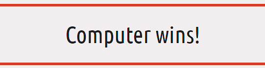
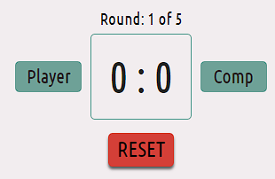

# Rock, Paper, Scissors, Lizard, Spock
(by Robyn Soar)

RPSLS (Rock, Paper, Scissors, Lizard, Spock) is a Website aimed at ages 4+, which contains a simple game of Rock, Paper, Scissors, Lizard, Spock. Made by Sam Kass & Karen Bryla, it is a game of chance which expanded on the traditional game of Rock, Paper, Scissors.
This Website allows users to play against the computer, with scores taken to document the winner of 3 games out of 5.

## Key Project Goals

## Target Audience

## Table of Contents

- [Features](#features)
    - [Site Wide](#sitewide)
    - [Landing Page](#landing-page)
    - [Existing Features](#existing-features)
    - [Features Left to Implement](#features-left-to-implement)
- [Design](#design)
    - [Wireframes](#wireframes)
    - [Colour Palette](#colour-palette)
    - [Google Fonts](#google-fonts)
    - [Technologies Used](#technologies-used)
- [Testing](#testing)
    - [Responsiveness](#responsiveness)
    - [Accessibility](#accessibility)
    - [Lighthouse Testing](#lighthouse-testing)
    - [Fuctional Testing](#functional-testing)
    - [Validator Testing](#validator-testing)
- [Deployment](#deployment)
    - [Version Control](#version-control)
    - [Deployment to GitHub Pages](#deployment-to-github-pages)
    - [Clone the Repository Code Locally](#clone-the-repository-code-locally)
- [Credits](#credits)
    - [Inspired Code](#inspired-code)
    - [Walkthrough Code](#walkthrough-code)
    - [Used Code](#used-code)
    - [Media](#media)
    - [Acknowledgements](#acknowledgements)
- [Author](#author)

## Features

The Website is made up of 2 pages, the landing page where the game is established, and a 404 error page incase of a broken link, of which will not be seen by the user unless an error occurs.

### Site Wide

- Logo
    - Clear and concise name that informs the user of what game is displayed on the Website.
    - Logo heading is hidden on smaller phone screens to allow the full game-area to be seen without the need to scroll.


- Favicon
    -- The site wite favicon show a hand gesture, this ties in with the hand gestures used within the game.
    - This provides an image in the tabs header to allow the user to easily identify the Website if they have multiple websites open at once.


### Landing Page

- Rules modal button
    - Under the logo heading is a "Rules" button, which opens a modal to inform the user of what played hand choice beats the other in the game of Rock Paper Scissors Lizard Spock.
    - Provides feedback to the user when hovered over and clicked.


- Rules modal
    - Once clicked and opened, the "Rules" modal shows the rules of the game to the user.
    - The modal window is animated and softly transitions onto the screen.
    - The modal can be closed by the user either by clicking the "x" in the top right corner, or by clicking outside off the modal.
    - The modal window takes up a small amount of the full Website and shows itself with a dark semi-opaque background to show the user they're still on the RPSLS Website.


- Game result
    - After each round during a game, the game results will change based on if the player (user) wins, the computer wins or if it ends in a tie.
    - The border surrounding the text changes colour, matching the theme of the Website accent colours as well as typical colour association with the colour green for a win, red for a loss, and yellow for average.
    - The default colour of the border is the standard black that is used for text site wide, with a message that quickly informs the user of how many rounds are played within one game.

Default colour and message


Win colour and message


Lose colour and message



Draw colour and message


- Choice display
    - The default text reads "1..2..3... GO! on both the player (user) and computer side of the "VS" before any rounds have been played.
    - After each round has been played, the hand chosen by the user is displayed along side the hand chosen at random by the computer.
    - This display provides instant feedback to the user and is more exciting than a simple win or lose notification.

Default choice display


One option after a hand has been chosen by the user and computer


- Scoreboard and reset button
    - Displays the current round of the game out of the total of 5 rounds playable within a game. This updates and informs the user how many more rounds are left before the overall winner is announced.
    - To the left and right of the scoreboard show the labels for which side the points are displayed for each competitor (player and computer).
    - The scoreboard points display updates after each round and increments each time the player (user) or computer wins.
    - Below is the reset button, this can be clicked at any point during a game or after the game has concluded to reset the whole game back to the start. This resets all displayed messages, results and points.
    - The reset button provides feedback to the user when hovered over or clicked.



- Hand choice buttons
    - Buttons for each hand choice display to the user in a matching style, clearly showing an easily recognisable hand gesture.
    - The buttons provide feedback to the user when hovered over or clicked.
    - Clicking any one of these gestures plays a round instantly.


### Existing Features

### Features Left to Implement

[Return to Table of Contents](#table-of-contents)

## Design

### Wireframes

### Colour Palette

The following colour palette was used throughout the Website to provide good contrast between elements and a 'retro' colour scheme to match the time period in which Star Trek (from which "Spock" is a character from) was first released.

- #F2EDEF - Background colour site-wide
- #FFC857 - Accent colour
- #DB3A34 - Accent colour
- #69A197 - Accent colour
- #252525 - Text colour site-wide


### Google Fonts

[Google Fonts](https://fonts.google.com/) was used to import fonts for the Website, these include:

- "Teko", sans-serif: Used for the Website logo and 'Rules' modal
- "Ubuntu Condensed", sans-serif: Used for all other text content site wide

### Technologies Used

- HTML
    - The main structure of the Website was developed using HTMl as the main language.

- CSS
    - The Website was styled using custom CSS in an external file.

- JavaScript
    - 

- GitHub
    - Source code is hosted on GitHub and deployed using Git Pages.

- Git
    - Used for development of the Website as well as commit and pushing code throughout.

- [Favicon.io](https://favicon.io/favicon-converter/)
    - Favicon files were created with this favicon converter.

- [TinyPNG](https://tinypng.com/)
    - Used TinyPNG to compress image assets to aid in the website running quicker.

- [Pixelied](https://pixelied.com/convert/jpg-converter/jpg-to-webp)
    - Used Pixelied to convert file types of image assets from jpg/png to webp to aid in the website running quicker.

- [Google Fonts](https://fonts.google.com/)
    - Used to import fonts used throughout the Website.

- [Coolors](https://coolors.co/)
    - Colour palette swatches.

- [Online PNG Tools](https://onlinepngtools.com/change-png-color)
    - Used to change the colours of the icons to match the site's colour palette.

[Return to Table of Contents](#table-of-contents)

## Testing

### Responsiveness

### Accessibility

### Lighthouse Testing

### Functional Testing

### Validator Testing

- HTML
    - [W3C Validator](https://validator.w3.org/)

- CSS
    - [W3C CSS Validation](https://jigsaw.w3.org/css-validator/)

- JavaScript
    - [JSHint Analysis Tool](https://jshint.com/)

### Unfixed Bugs

[Return to Table of Contents](#table-of-contents)

## Deployment

### Version Control

The site was created using the Git editor and pushed to GitHUb to the remote repository 'rpsls-game'

The following git commands were used throughout development to push code to the remote repository:

```git add <file>``` - This command was used to add the file(s) to the staging area before they are commited.

```git commit -m "commit message"``` - This command was used to commit changes to the local repository queue ready to be pushed.

```git push``` - This command was used to push all committed code to the remote repository 'rpsls-game' on GitHub.

### Deployment to GitHub Pages

The site was deployed to GitHub Pages. The steps to deploy are as follows:
1. In the GitHub repository, navigate to the 'Settings' tab
2. From the menu called 'Code and automation' on the left, select 'Pages'
3. From the Default branch drop down menu, select 'Main'
4. Click 'Save'
5. A live link will be displayed in a green banner when published succesfully.

The live link to 'rpsls-game' can be found here - [Rock, Paper, Scissors, Lizard, Spock Live]()

### Clone the Repository Code Locally

Navigate to the GitHub Repository you want to clone to use locally:
1. Click on the code drop down button
2. Click on HTTPS
3. Copy the repository link to the clipboard
4. Open your IDE of choice (Git must be installed for the next steps)
5. Type git close copied-git-url into the IDE terminal

The project will now of been cloned on your local machine for use.

[Return to Table of Contents](#table-of-contents)

## Credits

### Inspired Code

- [Woohoo Salon - Robyn Soar](https://github.com/RobynSoar/woohoo-salon/blob/main/README.md)
    - Rock, Paper, Scissors, Lizard, Spock's README.md layout and contents was inspired by my own README from a previous project, which was originially inspired by the following README:
        - [Taco Travels - Gareth McGirr](https://github.com/Gareth-McGirr/tacos-travels/blob/main/README.md)
            - Woohoo Salon's README.md layout and contents was inspired by this README.
        - [Writing a High Quality README! - Blog](https://dev.to/coderarchive/writing-a-high-quality-readme-1k3j)
            - Woohoo Salon's README.md layout and contents was also inspired by this README to confirm I had the correct content for a good quality README.

- [Code Insitute](https://learn.codeinstitute.net/ci_program/diplomainfullstacksoftwarecommoncurriculum)
    - Code Institute's programme helped me throughout the site with how to write sections of basic code.

### Walkthrough Code

- [W3Schools](https://www.w3schools.com/howto/howto_css_modals.asp)
    - RPSLS's 'rules' modal was created with the walkthrough from this website.

- [Hacker.io](https://hackr.io/blog/how-to-build-rock-paper-scissors-in-javascript)
    - Some parts of this walkthrough aided with a push in the right direction with JavaScript for the RPSLS game site.

### Used Code

- [Woohoo Salon - 404 Error Page](https://github.com/RobynSoar/woohoo-salon)
    - RPSLS 404 error page was made with code from my Woohoo Salon website, altered to suit the style of RPSLS game website.

### Media

- [Free ICONS Library](https://icon-library.com/)
    - Icons for the RPSLS game choices were found via this site.

- [Icons8](https://icons8.com/)
    - Favicon image.

### Acknowledgements

[Return to Table of Contents](#table-of-contents)

## Author

Robyn Soar
robyn999@hotmail.co.uk